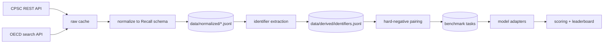

# Architecture

## Principles

1. **Reproducible, not archived.** We ship code and identifiers; anyone can
   rebuild the dataset from public APIs. This sidesteps redistribution limits and
   keeps the benchmark fresh.
2. **Living benchmark.** Roughly 30–50 new CPSC recalls appear each month. Test
   sets can be regenerated after any model's training cutoff, which limits
   contamination by construction.
3. **Stdlib only in the core.** Ingestion and extraction use no third-party
   packages, so the pipeline runs anywhere without a lockfile. Model adapters and
   analysis may add dependencies later, isolated from the core.
4. **Separate facts from judgements.** Authority data is copied verbatim into the
   normalized layer. Everything we infer (identifiers, hazard labels, difficulty)
   lives in the derived layer and is independently auditable.

## Data flow

All stages A through K are implemented. Human validation gates remain before a
public dataset release; see the roadmap.

## Modules

| Module | Responsibility |
|---|---|
| `reclume/schema.py` | `Recall` dataclass, HTML/whitespace cleaning, JSONL IO |
| `reclume/http.py` | Retry with exponential backoff, on-disk response cache |
| `reclume/ingest_cpsc.py` | CPSC fetch per year, defensive field flattening |
| `reclume/ingest_oecd.py` | OECD paginated search, taxonomy tags |
| `reclume/extract_identifiers.py` | Anchor-and-window identifier extraction |
| `reclume/negatives.py` | Three verified hard-negative families |
| `reclume/tasks.py` | T1–T4 construction and temporal splits |
| `reclume/evaluate.py` | USR, BOR, action and GPSR notice scoring |
| `reclume/cli.py` | End-to-end ingestion, construction and evaluation CLI |

## Unified schema

Both sources normalize into one `Recall` record:

| Field | Notes |
|---|---|
| `source`, `source_id` | `cpsc:25067`, `oecd:US-09009` |
| `recall_date` | ISO date; unreliable for OECD, see data sources |
| `title`, `description` | Description is CPSC-only and carries the identifiers |
| `product_names`, `hazards`, `remedies` | Free text, one entry per authority record |
| `manufacturers`, `retailers`, `countries` | Names as published |
| `upcs`, `images`, `sold_at`, `units`, `url` | |
| `tags` | OECD product taxonomy terms |

`searchable_text` concatenates title, description and product names; it is the
input to identifier extraction.

## Identifier extraction

CPSC leaves `Products[].Model` empty, so codes are recovered from prose:

1. Locate an anchor keyword (`model`, `sku`, `item`, `lot`, `style`, `serial`).
2. Take a 160-character window, truncated at the next sentence boundary.
3. Pull code-like tokens: alphanumeric, at least one digit, three or more chars.
4. Reject years, phone prefixes, and unit expressions such as `40V` or `20-in`.
5. Record `(kind, value, evidence)` so every extraction is traceable to its
   sentence.

UPCs are handled separately: digit runs following a `UPC` anchor are split into
8/11/12/13/14-digit chunks, and structured UPC fields are merged in.

This is a **baseline**, not the final extractor. It exists so that any LLM-based
replacement must demonstrate a measured improvement on a human-labelled sample.

## Extension points

- **New source:** add `ingest_<name>.py` exposing `normalize()` and a fetch
  function returning `list[Recall]`; register a CLI subcommand.
- **New extractor:** implement `extract(text) -> list[Identifier]` and evaluate it
  against the labelled sample before replacing the baseline.
- **Model adapter:** a callable `answer(prompt: str) -> str`, kept outside the
  core so API keys never touch ingestion code.
